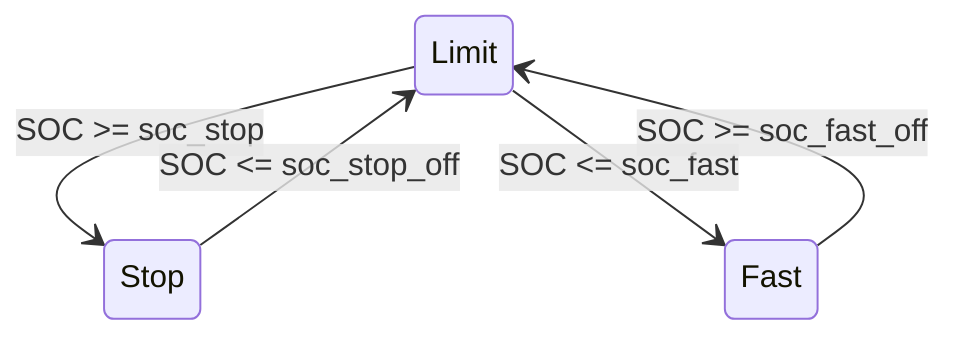

# qcom-batt-guard

`qcom-batt-guard` is a small daemon that controls the charger input current limit to keep the battery state-of-charge (SOC) within a configured range.

It periodically reads SOC from sysfs and adjusts `input_current_limit` accordingly.

## Background

This tool was developed for the [Xiaomi Mi 5 running mainline Linux](https://github.com/umeiko/KlipperPhonesLinux/releases/tag/Xiaomi-gemini).

`qcom-batt-guard` uses the standard Linux `power_supply` sysfs interface (battery SOC + USB online + charger input current limit) to implement a simple SOC guard.

Useful sysfs commands:

```bash
cat /sys/class/power_supply/qcom-battery/capacity
cat /sys/class/power_supply/qcom-smbcharger-usb/online
echo 550000 > /sys/class/power_supply/qcom-smbcharger-usb/input_current_limit
tree /sys/class/power_supply/*
cat /sys/class/power_supply/*/uevent
```

## How it works

The daemon maintains four states:

* **Offline**: USB power not present (no writes to `input_current_limit`)
* **Fast**: unrestricted charging current (high ICL)
* **Limit**: reduced charging current (medium ICL)
* **Stop**: charging disabled (ICL = 0 on this device)

With the default parameters:

* `soc_stop = 60` (enter **Stop** when SOC rises to this value)
* `soc_fast = 50` (enter **Fast** when SOC falls to this value)
* `soc_hyst = 4`  (hysteresis width)

Derived hysteresis thresholds:

* `soc_stop_off = soc_stop - soc_hyst` = **56** (leave **Stop** when SOC falls to 56 or below)
* `soc_fast_off = soc_fast + soc_hyst` = **54** (leave **Fast** when SOC rises to 54 or above)

### State diagram




## Usage


### Install as a systemd service

```bash
sudo ./install.sh
sudo journalctl -u qcom-batt-guard.service -f
```

### Running manually

```bash
cargo build --release
sudo RUST_LOG=info ./target/release/qcom-batt-guard
sudo RUST_LOG=debug ./target/release/qcom-batt-guard
```

### Command line options

```bash
$ ./target/release/qcom-batt-guard --help
Guard Qualcomm battery SOC by controlling USB input_current_limit (ICL)

Usage: qcom-batt-guard [OPTIONS]

Options:
      --soc-path <SOC_PATH>
          Path to battery state-of-charge (SOC) sysfs node, usually an integer percentage

          [default: /sys/class/power_supply/qcom-battery/capacity]

      --usb-online-path <USB_ONLINE_PATH>
          Path to USB online sysfs node. Expected values are usually 0 or 1

          [default: /sys/class/power_supply/qcom-smbcharger-usb/online]

      --icl-path <ICL_PATH>
          Path to USB input current limit sysfs node, in microamps (uA)

          [default: /sys/class/power_supply/qcom-smbcharger-usb/input_current_limit]

      --soc-stop <SOC_STOP>
          Enter Stop state when SOC is greater than or equal to this percentage

          [default: 60]

      --soc-fast <SOC_FAST>
          Enter Fast state when SOC is less than or equal to this percentage

          [default: 50]

      --soc-hyst <SOC_HYST>
          Hysteresis width, in percentage points.

          Stop exits at soc_stop - soc_hyst. Fast exits at soc_fast + soc_hyst.

          [default: 4]

      --icl-stop-ua <ICL_STOP_UA>
          ICL value for Stop state, in microamps (uA).

          On this device, 0 is used to stop charging.

          [default: 0]

      --icl-limit-ua <ICL_LIMIT_UA>
          ICL value for Limit state, in microamps (uA)

          [default: 550000]

      --icl-fast-ua <ICL_FAST_UA>
          ICL value for Fast state, in microamps (uA)

          [default: 3000000]

      --interval-ms <INTERVAL_MS>
          Main loop interval, in milliseconds

          [default: 10000]

  -h, --help
          Print help (see a summary with '-h')
```
